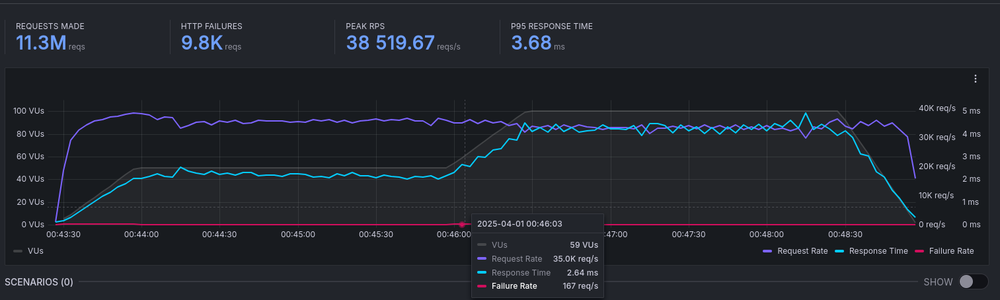

# kvcache

Key-value cache implemented using Golang

# Stats:

- ## v1
  

# Implementation:

## v0:

- Started with a very basic map without any locks.
- Noticed that it worked fine with less users, but then, as the users started increasing, the system failed, with an error, when multiple clients tried to access the map at the same time.

## v1:

- Now, I created a Map, but, with a mutex object, which will acquire a lock, when writing in the map. This way, when mmultiple clients try to acces the map, it will gracefully manage all the requests.

## Things that I tried, but failed, and will try again:

- Tried to implement sharding, so that there is less contention due to locking, since, only one shard will be locked for one request, making other shards available for operations.
- Also, I tried to implement an LRU cache to flush out the least recently used key-value pairs. I tried 2 ways:

  1. Using `last access time`. Since. there was a write operation taking place along with every read operation for updating the last access time, everytime, the map would acquire a lock, preventing other write opertions, making the writes in the cache slower.
  2. Moving the recently accessed key-value pair at the very end or at the very start, so that when there is a need to flush some cache, we know exactly which part can be flushed, but even this method required a write operation on every read.

  (But, now I think, I can tackle this problem, simply by creating a separate/new doubly linked list, which will only store the keys. Now, whenever I read a key, I can read from the map, but I will write in the doubly linked list. this way, my writes on the map will not get blocked. But one thing is that, this implementation will lead to a memory overhead, but let's try it.)

## The good and the bad:

- GOOD:
  - Has high concurrency - can manage more than 10,000 users.
  - Has very low latency - `3.68ms` (P95 response time)
  - Has very high throughput - `38,520` (Peak requests/sec)
- BAD:
  - No max limit set for keys and values. 💀
  - No custom configuration provided for now.
  - There occur a few failures at the very beginning, when clients start connecting.

## Installation Guide

### Prerequisites

Ensure you have Go 1.21 or later installed on your system.

### Building from Source

To get started with the source code, follow these steps:

```bash
# Clone the repository
git clone https://github.com/MrPhenomenal3110/kvcache.git
cd kvcache

# Build the project
go build -o kvcache ./cmd/kvcache

# Launch the server
./kvcache
```

### Installing via Go

Alternatively, you can install it directly using Go:

```bash
go install github.com/MrPhenomenal3110/kvcache@latest

# Start the server
./kvcache
```

### Running with Docker

If you prefer using Docker, follow these commands:

```bash
# Build the Docker image
docker build -t kvcache .
```

```bash
# Start a container from the image
docker run -p 7171:7171 kvcache
```

### Using DockerHub

You can also pull the prebuilt image from DockerHub:

```bash
# Fetch the latest image
docker pull premshah31/kvcache:latest

# Run the container
docker run -p 7171:7171 premshah31/kvcache:latest
```

## API Endpoints

### Storing a Value

To insert or update a value, make a `POST` request to:

```
POST /put
```

#### Request Body:

```json
{
  "key": "Uuu_ii_ii_aaa_ii_oo",
  "value": "Uuu_ii_ii_ii_aa_ii_oo"
}
```

#### Response:

```json
{
  "status": "OK",
  "message": "Key inserted/updated successfully."
}
```

### Retrieving a Value

To fetch a stored value, send a `GET` request with the key as a query parameter:

```
GET /get?key=Uuu_ii_ii_aaa_ii_oo
```

#### Success Response:

```json
{
  "status": "OK",
  "key": "Uuu_ii_ii_aa_ii_oo",
  "value": "Uuu_ii_ii_ii_aa_ii_oo"
}
```

#### Error Response (Key Not Found):

```json
{
  "Status": "Not found",
  "Message": "Key not found"
}
```
